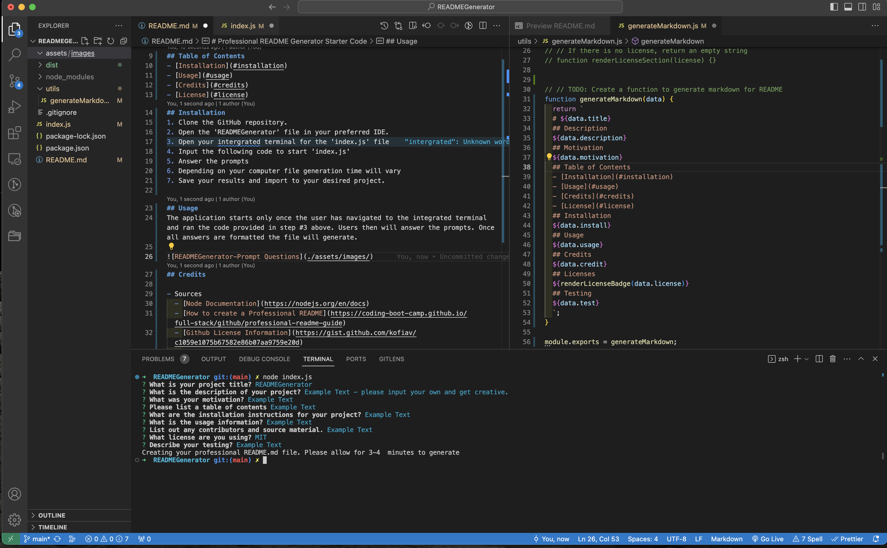

# Professional README Generator

## Overview

The README Generator is an efficiency tool developed with JavaScript and Node.js. It harnesses the capabilities of the `inquirer` package and the File System module to offer an intuitive interface. This utility streamlines the generation of 'README.md' files, allowing developers to dedicate more time to coding and less to the intricacies of README formatting.

## Objective

The genesis of this project was the recognition of the often tedious process entailed in crafting a well-structured 'README.md'. With much of a README being boiler-plate in structure, the aim was to simplify and automate as much of its creation as possible.

## Table of Contents

- [Installation](#installation)
- [Usage](#usage)
- [Acknowledgements](#acknowledgements)
- [License](#license)

## Installation

1. Clone the GitHub repository.
2. Navigate to the 'READMEGenerator' directory in your favorite IDE.
3. Launch the integrated terminal and navigate to the 'index.js' file.
4. Execute the command specified in the next section to initiate 'index.js'.
5. Respond to the interactive prompts.
   - The file generation time might vary based on system specifications.
6. Once generated, save the README file and incorporate it into your project as needed.

## Usage

To utilize the application, ensure you're in the correct directory and run the command mentioned in the installation step #4. As you progress through the prompts, upon completion, the 'README.md' file will be generated seamlessly.

### Special Usage Note:

    The command line will not execute twice. You must delete the "/dist" folder in order to run the application again.

## Acknowledgements

- Resources:

  - [Node Documentation](https://nodejs.org/en/docs)
  - [Guide to Crafting a Professional README](https://coding-boot-camp.github.io/full-stack/github/professional-readme-guide)
  - [Github License Information](https://gist.github.com/kofiav/c1059e1075b67582e86b07aa9759e20d)
  - [YouTube Tutorial](https://www.youtube.com/watch?v=Qf5EXOyGRxw)
  - Source Code graciously provided by UT Austin and EDX.

- Special thanks to the dedicated team of teaching assistants and instructors for their invaluable feedback and mentorship.

## License

